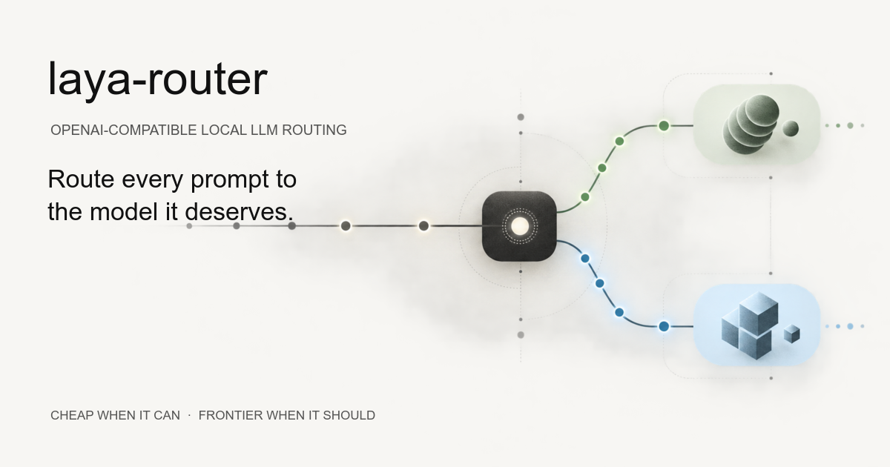
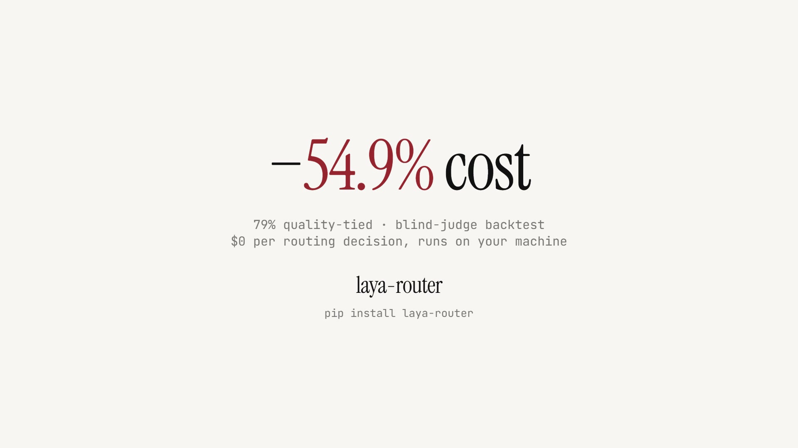

<p align="center">
  
</p>

<p align="center">
  <strong>The local routing layer for OpenAI-compatible LLM apps.</strong><br />
  Send each prompt to the affordable model when it is enough, and to the frontier model when it matters.
</p>

<p align="center">
  <a href="https://github.com/Gjusev/laya-router/actions/workflows/ci.yml"></a>
  <a href="https://pypi.org/project/laya-router/"></a>
  <a href="pyproject.toml"></a>
  <a href="LICENSE"></a>
</p>

<p align="center">
  <a href="#quickstart"><strong>Get started</strong></a> ·
  <a href="#watch-the-demo"><strong>Watch demo</strong></a> ·
  <a href="#how-it-works"><strong>How it works</strong></a> ·
  <a href="#configuration"><strong>Configure</strong></a>
</p>

<p align="center">
  
</p>

## One base URL. The right model for every prompt.

`laya-router` is an OpenAI-compatible proxy. Point an existing SDK at it, keep the rest of the request unchanged, and a local [laya](https://github.com/NandhaKishorM/laya) System 1 model decides which upstream tier should answer.

Routing runs on your machine and costs **$0 in API charges**. It is deliberately conservative: complex or uncertain requests are escalated to the frontier tier; the cheap tier handles the rest.

| Measured on the published backtest | What it means |
| --- | --- |
| **80.6%** routed to the cheap tier | Fewer requests pay frontier prices |
| **54.9%** estimated cost reduction | Compared with always using the frontier tier |
| **79.3%** cheap win/tie rate | Blind-judge result among cheap-routed prompts |
| **$0** per routing decision | The decision model is local |

These figures come from 180 prompts using a GLM cheap/frontier pair; see [the reproducible evaluation](#backtest-reproducible) for methodology and caveats.

## Watch the demo

<video src="brag-output/brag.mp4" poster="brag-output/brag.jpg" controls muted playsinline width="960">
  <a href="brag-output/brag.mp4"></a>
</video>

<p align="center">
  <a href="brag-output/brag.mp4"><strong>Play the 20-second demo</strong></a> · A client changes one URL; response headers show the local routing decision.
</p>

> If a Markdown renderer does not support inline video, use the play link above. The MP4 and its poster are versioned with the repository.

## Quickstart

Install the proxy, provide an upstream key (or forward each client's key), and run it:

```bash
pip install laya-router
export LAYA_ROUTER_UPSTREAM_API_KEY=sk-...
laya-router
# Serving OpenAI-compatible endpoints at http://127.0.0.1:8000/v1
```

Then change only `base_url` in a normal OpenAI client:

```python
from openai import OpenAI

client = OpenAI(
    base_url="http://127.0.0.1:8000/v1",
    api_key="sk-...",  # forwarded when no upstream key is configured
)

completion = client.chat.completions.create(
    model="ignored-by-proxy",
    messages=[{"role": "user", "content": "Say hi in three words"}],
)

print(completion.choices[0].message.content)
```

The client's `model` value is intentionally ignored: the router chooses it. Other body fields, including `temperature`, tools, and `max_tokens`, are forwarded untouched.

### Other ways to run it

```bash
# Docker
docker build -t laya-router .
docker run -p 8000:8000 -e LAYA_ROUTER_UPSTREAM_API_KEY=sk-... laya-router

# From source (Python 3.10+, uv)
git clone https://github.com/Gjusev/laya-router.git && cd laya-router
uv venv && uv pip install -e ".[dev]"
uv run laya-router
```

Runnable examples: [`examples/quickstart.py`](examples/quickstart.py) and [`examples/streaming.py`](examples/streaming.py).

## How it works



The decision pipeline has three layers, from cheapest to most cautious:

1. **Fast path** -- trivial greetings and zero-content prompts match a regex and go directly to the cheap tier without model inference.
2. **Local laya decision** -- one forward pass labels the prompt `simple`, `standard`, or `complex` and returns a calibrated confidence.
3. **Confidence gate** -- complex, unknown, or low-confidence requests go to the frontier tier. The default favors answer quality when the router is unsure.

Every response makes the choice inspectable:

```console
$ curl -s http://127.0.0.1:8000/v1/chat/completions \
    -H "Authorization: Bearer sk-..." -H "Content-Type: application/json" \
    -d '{"model":"ignored","messages":[{"role":"user","content":"Say hi"}]}' -i

HTTP/1.1 200 OK
x-laya-route: cheap
x-laya-model: gpt-4o-mini
x-laya-confidence: 0.8957
x-laya-reason: complexity=simple
```

| Response header | Meaning |
| --- | --- |
| `X-Laya-Route` | Chosen tier: `cheap` or `frontier` |
| `X-Laya-Model` | Upstream model actually used |
| `X-Laya-Confidence` | Calibrated decision confidence (`1.0` on the fast path) |
| `X-Laya-Reason` | Trace such as `complexity=simple`, `+low-confidence`, or `fast-path:trivial` |

## Compatibility

The proxy forwards to any OpenAI-compatible upstream. The default upstream is `https://api.openai.com/v1`; it can also sit in front of providers such as vLLM, Ollama, OpenRouter, or Z.ai.

| Surface | Status |
| --- | --- |
| `POST /v1/chat/completions` | Full request passthrough; only the upstream model is swapped |
| Streaming chat completions | SSE is relayed as it arrives |
| Tools, JSON mode, and other request fields | Passed through unchanged (tool calls are not yet separately covered by tests) |
| `GET /healthz` and `GET /metrics` | Built-in operational endpoints |
| Embeddings, models, and other OpenAI endpoints | Out of scope for v1 |

## Configuration

All options use `LAYA_ROUTER_*` environment variables and can also be loaded from a `.env` file.

| Variable | Default | Purpose |
| --- | --- | --- |
| `LAYA_ROUTER_UPSTREAM_BASE_URL` | `https://api.openai.com/v1` | Target OpenAI-compatible API |
| `LAYA_ROUTER_UPSTREAM_API_KEY` | unset | Use this key upstream, or forward the client's `Authorization` header when unset |
| `LAYA_ROUTER_TIERS_FILE` | packaged `tiers.yaml` | Models and list prices for the two tiers |
| `LAYA_ROUTER_UPSTREAM_TIMEOUT_S` | `120` | Upstream request timeout in seconds |
| `LAYA_ROUTER_MIN_CONFIDENCE` | `0.45` | Escalate below this value; `0` disables the confidence gate |
| `LAYA_ROUTER_DECISION_LOG` | unset | JSONL decision-log path |
| `LAYA_ROUTER_RATE_LIMIT_RPM` | `0` (off) | Per-client-IP requests per minute |

The tier file is ordinary YAML, so the model pair is yours to choose:

```yaml
cheap:
  model: gpt-4o-mini
  price: {input_per_m: 0.15, output_per_m: 0.60}
frontier:
  model: gpt-4o
  price: {input_per_m: 2.50, output_per_m: 10.00}
```

## Production notes

- **Cold start:** laya loads its checkpoints once (about 10 seconds on CPU) and stays warm afterward.
- **Warm routing latency:** on the included AMD64 benchmark (179 prompts), p50 was 460 ms, p95 1.4 s, and p99 2.7 s. Routing is free in API cost, not latency; run the proxy close to the workload when latency matters. Reproduce it with `make bench`.
- **Metrics:** `GET /metrics` exposes `laya_router_requests_total{tier,status}` and `laya_router_routing_seconds`, including degraded paths.
- **Decision log:** set `LAYA_ROUTER_DECISION_LOG` to record tier, model, complexity, confidence, reason, status, routing latency, and a truncated prompt preview as JSONL.
- **Rate limiting:** set `LAYA_ROUTER_RATE_LIMIT_RPM` to return OpenAI-shaped `429` responses with `Retry-After`.
- **Failure mode:** when the routing engine fails, the proxy returns an explicit structured `503`; it never silently sends everything to the frontier tier.

## Backtest (reproducible)

The evaluation sends every prompt to **both** tiers, then uses a blind judge (fixed rubric, temperature 0, seeded A/B order) to compare the answers. A cheap route is counted as correct when the cheap answer wins or ties; a cheap loss is a miss; a frontier route on a simple request is an over-escalation.

```bash
# OpenAI run: roughly $5-10 for 300 prompts x 2 tiers
export OPENAI_API_KEY=sk-...
make backtest

# Same pipeline with the published Z.ai GLM model pair
export OPENAI_API_KEY=<your-z.ai-key>
make backtest-glm
```

The published run uses 80 MT-Bench questions and 100 synthetic trivial prompts. Its tiers are `glm-5.3-flash` (cheap) and `glm-5.3` (frontier), with `glm-5.3` as judge. The underlying [dataset](backtest/dataset.jsonl), [tier answers](backtest/results.jsonl), and [judgements](backtest/judgements.jsonl) are committed.

| Metric | Result |
| --- | --- |
| Prompts answered by both tiers | 180 |
| Routed to cheap | 80.6% |
| Cost saving vs. always-frontier | 54.9% |
| Cheap win / tie / loss (cheap-routed) | 28 / 87 / 30 |
| Routing precision (cheap win or tie) | 79.3% |
| Costly over-escalations | 35 |
| API cost of routing itself | $0 |

Confidence-gate calibration, simulated from the recorded per-prompt confidences:

| `min_confidence` | Cheap routes | Cost saving | Misses | Precision |
| --- | ---: | ---: | ---: | ---: |
| `0.0` (off) | 80.6% | 54.9% | 30 | 79.3% |
| `0.45` (default) | ~72% | ~46% | ~27 | ~79% |
| `0.55` | 53.3% | 30.0% | 21 | 78.1% |
| `0.70` | 27.2% | 10.4% | 10 | 79.6% |

The evaluation has real limits: one judge and one model pair, a measurable judge-noise floor on trivial prompts, and too few middle-band prompts. Treat the numbers as transparent baseline evidence, not a universal quality claim. More detail is in [`backtest/`](backtest/).

## Development

```bash
uv venv && uv pip install -e ".[dev]"
pytest            # offline unit + integration tests
pytest -m slow    # real laya engine; downloads checkpoints on first run
make backtest     # full evaluation pipeline; needs an upstream API budget
```

```text
src/laya_router/   FastAPI server, policy, routing, config, observability
backtest/          Dataset builder, both-tier runner, blind judge, analysis
examples/          OpenAI SDK and streaming examples
tests/             Offline-by-default test suite; @slow marks checkpoint tests
assets/            README diagrams, branding, and social-preview image
brag-output/       20-second product demo and poster
```

## Roadmap

- [x] Chat completions and local laya tier routing
- [x] SSE streaming passthrough
- [x] Deterministic fast paths and confidence gating
- [x] Prometheus metrics, decision logs, health endpoint, and Docker
- [x] Reproducible backtest with published results
- [x] PyPI distribution: `pip install laya-router`
- [ ] Additional OpenAI-compatible endpoints

Contributions are welcome. Please open an issue before non-trivial work, use conventional commits (`feat:`, `fix:`, `test:`, `docs:`, `chore:`), and keep code and documentation in English.

## License

Apache-2.0. See [LICENSE](LICENSE).
